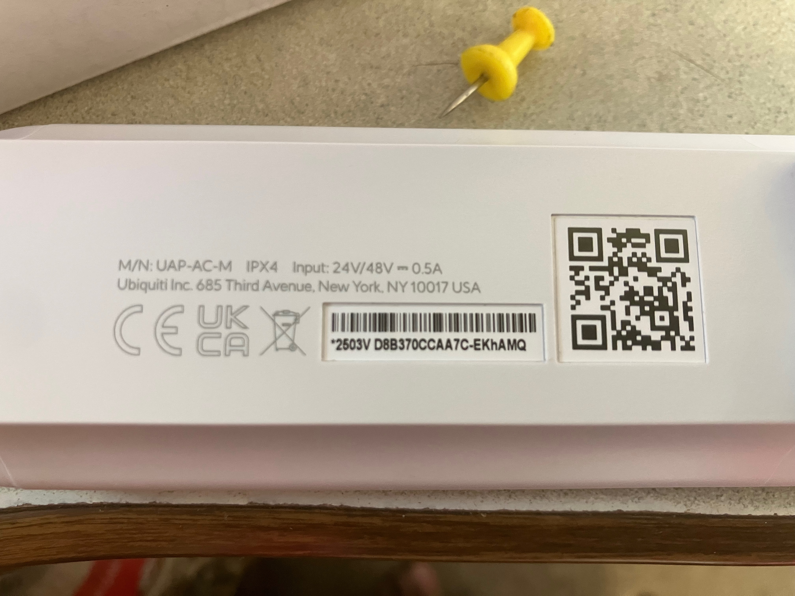

# Ubiquiti UniFi AC Mesh Device Information

## Device Specifications
- **Model**: UAP-AC-M-US
- **Manufacturer**: Ubiquiti Networks (unifi.ui.com)
- **Purchased**: 2025-07 from Amazon
- **Status**: New device, integration pending
- **Device Name**: `wolfden-mesh`
- **MAC Address**: D8:B3:70:CC:AA:7C

## Hardware Features
- **WiFi**: 802.11ac dual-band (2.4GHz + 5GHz)
- **Power**: PoE (Power over Ethernet) - 24V passive
- **Mounting**: Outdoor/indoor mounting capability
- **Antenna**: Integrated dual-band antennas
- **Ethernet**: 10/100/1000 Mbps port

## Device Label



**OCR Text from Label:**
```
M/N: UAP-AC-M
IPX4
Input: 24V/48V-0.5A
Ubiquiti Inc. 685 Third Avenue, New York, NY 10017 USA
CE UK CA
*2503V D8B370CCAA7C-EKHAMQ
```

**Key Information:**
- **Model**: UAP-AC-M
- **Power**: 24V/48V DC at 0.5A (passive PoE)
- **Weather Rating**: IPX4 (splash-resistant)
- **MAC Address**: D8:B3:70:CC:AA:7C (for mesh adoption)
- **Part Number**: 2503V (hardware revision/version)
- **Serial Number**: EKHAMQ (unique device identifier)
- **Complete ID**: 2503V D8B370CCAA7C-EKHAMQ

## Operating Modes
1. **Mesh Peer Mode** (Default)
   - Joins existing UniFi mesh network
   - Requires UniFi controller access
   - Not suitable for Trails End CG (no admin access)

2. **Standalone Access Point Mode** (Target)
   - Independent operation
   - WiFi client mode capability
   - No controller required
   - Suitable for Trails End CG

## Power Requirements
- **PoE Injector**: Required (not included)
- **Voltage**: 24V passive PoE
- **Power Consumption**: ~8W max
- **Cable**: Single Cat5/6 for power + data

## Network Integration
- **Current Role**: Pending integration
- **Target Role**: WiFi client bridge to Trails End networks
- **Integration Path**: [Setup Guide](ubiquiti_setup.md) 