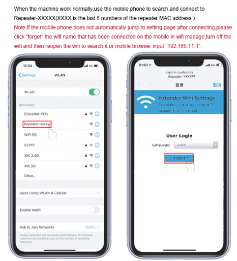
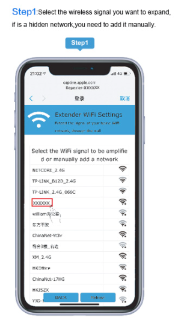
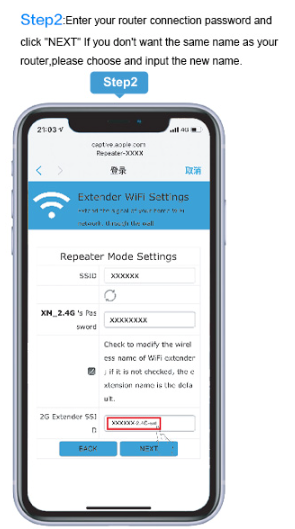
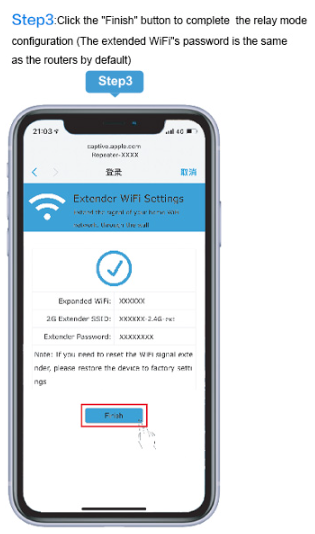
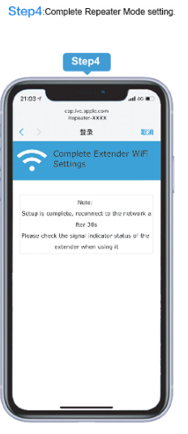
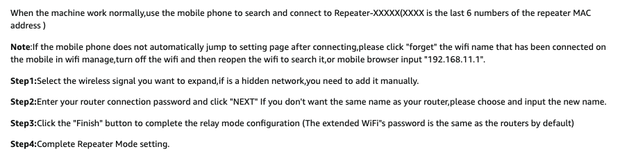

# Cheapo Extender

<https://www.amazon.com/dp/B0DCBYCHR7?ref=ppx_yo2ov_dt_b_fed_asin_title> Purchased from Amazon 2025-08-10 for $18.

Product Description

wifi extender
This USB WiFi repeater is easy to carry and its compact design makes it a great choice for both home and office use. It can be easily plugged into most USB sockets (such as wall sockets, rechargeable battery sockets, outdoor energy storage sockets) for easy setup. It has universal compatibility and is compatible with the vast majority of WiFi routers on the market. It can connect to all standard routers or gateways, expand WiFi signal range, eliminate signal blind spots, and provide stable and smooth network connections whether at home, office, or outdoors. It is compact and does not take up space, making it easy to store and carry.

Quick Installation Guide
wifi extender
portable wifi extender
When the machine work normally,use the mobile phone to search and connect to Repeater-XXXXX(XXXX is the last 6 numbers of the repeater MAC address )

Note:If the mobile phone does not automatically jump to setting page after connecting,please click "forget" the wifi name that has been connected on the mobile in wifi manage,turn off the wifi and then reopen the wifi to search it,or mobile browser input "192.168.11.1".

Step1:Select the wireless signal you want to expand,if is a hidden network,you need to add it manually.

Step2:Enter your router connection password and click "NEXT" If you don't want the same name as your router,please choose and input the new name.

Step3:Click the "Finish" button to complete the relay mode configuration (The extended WiFi"s password is the same as the routers by default)

Step4:Complete Repeater Mode setting.

Product Lntroduction
portable wifi extender

External dual antenna Full grud signal coverage
High gain exernal dual antennas for longer signal transmission Smooth data transmission with superior penetration power

wifi extender

USB Power Supply
Compatible with various USB ports

wifi extender

Mini Design
Small size design, suitable for different scenarios.

## Quick Installation Guide

### Step 1

### Step 2

### Step 3

### Step 4

### Notes

