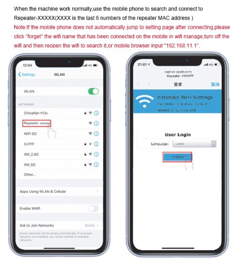
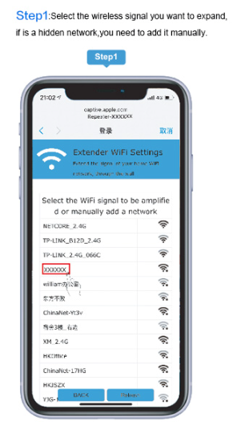
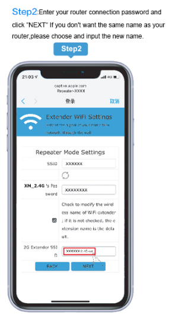
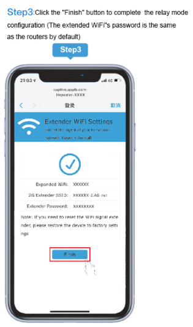
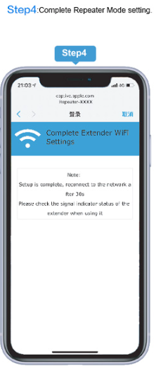
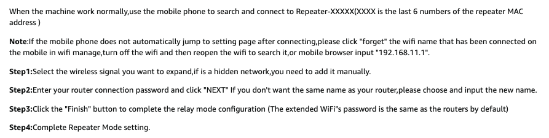

# Cheapo Extender -- $18 USB WiFi Repeater

**Model:** Amazon B0DCBYCHR7 (generic dual-antenna USB WiFi repeater)  
**Purchased:** 2025-08-10 for $18  
**Tested at:** Trails End Campground, 2026-07-11  
**URL:** <https://www.amazon.com/dp/B0DCBYCHR7?ref=ppx_yo2ov_dt_b_fed_asin_title>

Product Description

wifi extender
This USB WiFi repeater is easy to carry and its compact design makes it a great choice for both home and office use. It can be easily plugged into most USB sockets (such as wall sockets, rechargeable battery sockets, outdoor energy storage sockets) for easy setup. It has universal compatibility and is compatible with the vast majority of WiFi routers on the market. It can connect to all standard routers or gateways, expand WiFi signal range, eliminate signal blind spots, and provide stable and smooth network connections whether at home, office, or outdoors. It is compact and does not take up space, making it easy to store and carry.

Quick Installation Guide
wifi extender
portable wifi extender
When the machine work normally,use the mobile phone to search and connect to Repeater-XXXXX(XXXX is the last 6 numbers of the repeater MAC address )

Note:If the mobile phone does not automatically jump to setting page after connecting,please click "forget" the wifi name that has been connected on the mobile in wifi manage,turn off the wifi and then reopen the wifi to search it,or mobile browser input "192.168.11.1".

Step1:Select the wireless signal you want to expand,if is a hidden network,you need to add it manually.

Step2:Enter your router connection password and click "NEXT" If you don't want the same name as your router,please choose and input the new name.

Step3:Click the "Finish" button to complete the relay mode configuration (The extended WiFi"s password is the same as the routers by default)

Step4:Complete Repeater Mode setting.

Product Lntroduction
portable wifi extender

External dual antenna Full grud signal coverage
High gain exernal dual antennas for longer signal transmission Smooth data transmission with superior penetration power

wifi extender

USB Power Supply
Compatible with various USB ports

wifi extender

Mini Design
Small size design, suitable for different scenarios.

## Quick Installation Guide



### Step 1



### Step 2



### Step 3



### Step 4



### Notes



---

## Field Test Results -- Trails End Campground (2026-07-11)

### Setup Process (Step-by-Step)

**Objective:** Repeat "Trails End Wifi" AP as "Trails End Wifi-Site 1" for RV coverage test.

#### Step 1: Power On & Find Maintenance SSID

1. Plug USB repeater into USB power source (phone charger, power bank, USB hub)
2. Wait 30-60 seconds for boot
3. Scan for SSID: **`Repeater-XXXXXX`** (last 6 chars are device MAC)
   - Example: `Repeater-2827f1`
   - Signal: typically -28 to -35 dBm from nearby location
   - **Note:** May not appear in macOS WiFi selector; visible in network scans (`airport scan`, `iwlist scan`, `networksetup`)

#### Step 2: Connect to Maintenance SSID (Phone or Web Browser)

- Use iPhone or Android phone (not MacBook -- macOS may not see it)
- Search for `Repeater-XXXXXX` SSID
- No password required; open network
- Once connected, browser should auto-redirect to setup page
  - If not, manually navigate to `192.168.11.1` or `192.168.1.1`

#### Step 3: Select Source SSID

1. Setup page presents list of nearby SSIDs
2. Select the AP you want to repeat: **`Trails End Wifi`**
3. Click NEXT

#### Step 4: Enter AP Password (if needed)

- If AP is open/unencrypted: skip password step
- If AP requires password: enter it now
- Click NEXT

#### Step 5: Rename Rebroadcast SSID (Optional)

1. Choose new SSID name for repeater output: **`Trails End Wifi-Site 1`** (example)
2. Or keep same name as source AP (not recommended; confuses clients)
3. Click NEXT

#### Step 6: Complete Setup

1. Click FINISH
2. Device reboots; Maintenance SSID disappears
3. New SSID (`Trails End Wifi-Site 1`) should appear within 60 seconds
4. Repeater is now online

#### Step 7: (Optional) Add Password to Rebroadcast SSID

**To add WPA2 security to your rebroadcast SSID:**

1. Connect to repeater's maintenance SSID again (may require reboot or manual reset)
   - Press and hold reset button on repeater for ~10 seconds to trigger maintenance mode
2. Access web UI at `192.168.11.1` or `192.168.1.1`
3. Look for **Wireless Settings** or **SSID Settings**
4. Find your rebroadcast SSID (`Trails End Wifi-Site 1`)
5. Set **Security Type:** WPA2-Personal (or WPA3 if available)
6. Set **Password:** Choose secure passphrase (12+ characters)
7. Click SAVE/APPLY
8. Device reboots; new SSID now requires password

---

## Connecting from MacBook

**Problem:** Repeater SSID doesn't appear in macOS WiFi menu.

**Solution:** Manually add SSID in System Settings.

### Method 1: System Settings (GUI)

1. **System Settings** → **Network** → **WiFi**
2. Click **WiFi** in sidebar, then click **Advanced...**
3. Click **+** (add network)
4. Enter:
   - **Network Name (SSID):** `Trails End Wifi-Site 1` (or your rebroadcast name)
   - **Security:** Open (if no password) or WPA2/WPA3 Personal (if password protected)
   - **Password:** *(only if security is enabled)*
5. Click **Join**
6. macOS connects and saves the network

### Method 2: Command Line (Terminal)

```bash
# Connect to open network (no password)
networksetup -setairportnetwork en0 "Trails End Wifi-Site 1"

# Connect to WPA2 network (with password)
networksetup -setairportnetwork en0 "Trails End Wifi-Site 1" "your-password-here"
```

Replace `your-password-here` with the actual password if you set one.

### Method 3: Create Network Profile (Persistent)

For recurring connections, create a network profile in a location:

1. **System Settings** → **Network** → **Location** → **Add Location**
2. Name it: `Trails End Repeater`
3. Configure **WiFi** service:
   - Select `Trails End Wifi-Site 1`
   - Enter security settings if needed
4. Click **Done**
5. Now switching to this location auto-connects to the repeater SSID

---

### Test Results (Trails End Campground, 2026-07-11)

| Test                        | Result        | Notes                                                                              |
|-----------------------------|---------------|------------------------------------------------------------------------------------|
| **iPhone connection**       | ✅ Connected   | To `Trails End Wifi-Site 1`; signal -28 to -32 dBm                                 |
| **iPhone speedtest**        | ❌ Error       | Failed partway through; may be network/routing issue                               |
| **MacBook visibility**      | ❌ Not visible | `Trails End Wifi-Site 1` does NOT appear in macOS WiFi selector                    |
| **Network scan visibility** | ✅ Visible     | Shows up in `rv-network` output (Bash command scans); MAC-based enumeration        |
| **Data throughput**         | ⚠️ Untested   | Could not complete speedtest on iPhone; WiFi signal present but network unreliable |

---

### Known Issues & Limitations

1. **macOS WiFi selector ignores it:** SSID broadcasts but macOS doesn't display it in the menu. Workaround: manually enter SSID name in network settings, or use iPhone/other device instead.

2. **Speedtest failure on iPhone:** Completed connection and DHCP, but speedtest failed mid-run. Possible causes:
   - Repeater backhaul weak/unstable (two-hop WiFi: iPhone → Cheapo → Trails End Wifi)
   - Network timeout on longer tests
   - Repeater's CPU/memory limited (only $18 device)

3. **USB power required:** Device must stay powered; no battery option. Requires AC outlet or power bank nearby.

4. **Range/signal degradation:** As a repeater (not a true AP), throughput is halved due to shared bandwidth. Expected: ~50% of source AP's speed.

---

### When to Use (Pros) vs. Alternatives

| Scenario             | Cheapo Repeater      | loco-bridge (NanoStation)  | Hot-zone Router (Beryl)    |
|----------------------|----------------------|----------------------------|----------------------------|
| **Quick test**       | ✅ Yes (15 min setup) | ❌ No (bench config needed) | ⚠️ Maybe (power/placement) |
| **Mac access**       | ❌ No (not visible)   | ✅ Yes (stable AP)          | ✅ Yes                      |
| **Throughput**       | ⚠️ Low (halved)      | ✅ High (direct AP)         | ✅ High (direct AP)         |
| **Cost**             | ✅ $18                | ⚠️ $200+                   | ⚠️ $300+                   |
| **Exterior grade**   | ❌ No                 | ✅ Yes                      | ⚠️ Depends on model        |
| **Long-term stable** | ❌ No (repeater)      | ✅ Yes                      | ✅ Yes                      |

---

### Recommendation

**Cheapo repeater:** Good for iPhone-only temporary test. Not suitable for MacBook work or long-term use (halved throughput, repeater architecture fragile).

**Next steps:** If iPhone test shows ~1+ Mbps throughput, repeater is viable interim. Otherwise, pursue loco-bridge or hot-zone router options.
