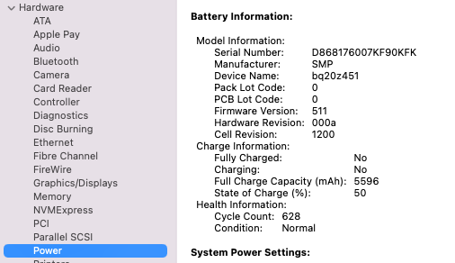

# MacBook Shopping Tracker

---

## Machine Requirements

### Michael's Requirements

**Primary workload:** Claude Code (cloud-based) + light git operations + bash scripting.

| Requirement         | Must-have | Details                                                              |
|---------------------|-----------|----------------------------------------------------------------------|
| **CPU**             | M-series  | M3+ preferred for Homebrew support and modern macOS; M2 acceptable   |
| **RAM**             | 16GB      | 8GB minimum works; 16GB recommended for multi-file Claude sessions   |
| **Storage**         | 256GB+    | Code repos + Claude cache                                            |
| **macOS**           | Tahoe+    | Monterey acceptable but EOL mid-2026; Tahoe/Sonoma preferred         |
| **Battery health**  | >80%      | For used/refurbished; confirm cycle count and original Apple battery |
| **Activation Lock** | Clean     | Must be free of MDM enrollment and Activation Lock                   |
| **Warranty**        | Preferred | 1-year+ coverage valuable for refurbished/used machines              |
| **Homebrew**        | No Intel  | Apple Silicon avoids deprecation warnings (cosmetic but annoying)    |

**Why these matter:** Claude Code is cloud-based (low local load). Git is pure CLI. M-series avoids Homebrew nag. 16GB RAM provides headroom for multi-file analysis.

**AI/Claude Code specific:** Stable WiFi/ethernet, low latency API calls. No GPU needed (cloud inference). Browser memory for large context windows (16GB headroom).

**Not needed:** Native IDEs, compilers, video editing, GPU (integrated is sufficient), high local CPU, native LLM training.

---

### Wendy's Requirements

**Primary workload:** Safari browser with 10-50+ concurrent tabs + SaaS web services (ChatGPT, Sheets, Docs, MailChimp, webmail).

| Requirement         | Must-have | Details                                                             |
|---------------------|-----------|---------------------------------------------------------------------|
| **CPU**             | ANY       | CPU is NOT the bottleneck; M2/M3/M4 all sufficient for web browsing |
| **RAM**             | 16GB      | **CRITICAL.** Safari tab management requires 16GB minimum           |
| **Storage**         | 256GB+    | SaaS data lives in cloud; local storage is minimal need             |
| **macOS**           | Tahoe+    | Monterey acceptable short-term (EOL mid-2026); prefer Tahoe/Sonoma  |
| **Display quality** | 1080p+    | For streaming video (Amazon Prime) and web browsing clarity         |
| **Video codec**     | 1080p+    | Streaming playback support (H.264, VP9)                             |
| **Battery health**  | >80%      | For used/refurbished; confirm cycle count                           |
| **Activation Lock** | Clean     | Must be free of MDM enrollment                                      |
| **Warranty**        | Preferred | 1-year+ coverage; return policy valuable for peace of mind          |

**Why these matter:** RAM is the limiter for 50+ Safari tabs. CPU is irrelevant (cloud-first user). Display quality for video streaming and web comfort. Battery health ensures machine doesn't fail mid-day.

**Zoom calls specific:** Built-in mic/camera sufficient (1080p+ video). Thermal management (quiet fan or fanless). Stable WiFi. Audio codec support (Opus, H.264 video).

**Not needed:** High CPU, discrete GPU (integrated is sufficient), compilers, development tools, large local storage, gaming/3D capabilities.

---

## CPU Comparison: Intel vs M1-M5

| Chip                                         | Year | Details                                                              |
|----------------------------------------------|------|----------------------------------------------------------------------|
| **Intel i5 1.8 GHz dual-core** (wolf-air)    | 2015 | Baseline; Homebrew nags; Monterey capped; aging display (1440×900)   |
| **Intel i5 2.0 GHz quad-core** (michael-pro) | 2020 | Sequoia support; Tahoe-compatible but aging; thermal throttling risk |
| M1                                           | 2020 | 8x leap over Intel; fanless; can run Claude Code; still solid used   |
| M2                                           | 2021 | +15% speed; same core count; good refurb value                       |
| **M3**                                       | 2023 | +25% speed; efficiency bump; **recommended for Michael**             |
| M4                                           | 2024 | +15% speed; overkill for light development; cost jump                |
| M5                                           | 2025 | +20% speed; longest OS support; expensive; not needed                |

**Practical takeaway:** M3 is the sweet spot for Michael (git + Claude Code). M2 acceptable if found cheap. Intel (wolf-air/michael-pro) = risky (aging, thermal issues). M4/M5 = wasted performance for your use case.

---

## How to Find Battery Cycle Count (GUI)

When asking sellers for battery health, they can check this way without Terminal:

1. Click **Apple menu** (top-left) → **About This Mac**
2. Click **System Report...** button
3. In the left sidebar, click **Power**

**What to look for:** The Power section shows Health Information with Cycle Count and Condition.  In this example, Cycle Count is "628" and Condition is "Normal"

1. Look for **Cycle Count** in the Health Information section (e.g., "628 cycles")
2. Look for **Condition** (should be "Normal" or "Good"; avoid "Fair" or "Replace Soon")
3. Send you a screenshot, or photo, or simple text with the two values

**Rule of thumb:**

- Under 300 cycles = excellent (new);
- 300-700 = good (refurb baseline);
- 700-1000 = acceptable (used);
- >1000 = worn (avoid unless heavily discounted).

---

## Air vs Pro: Does It Matter?

**Short answer:** Not for Michael or Wendy. Air is perfectly adequate and cheaper.

| Factor          | MacBook Air                               | MacBook Pro (13-16")                  |
|-----------------|-------------------------------------------|---------------------------------------|
| **Target**      | Consumers, light work                     | Professionals, compute-heavy work     |
| **Weight**      | ~2.7-3.1 lbs                              | ~3.4-4.7 lbs (heavier)                |
| **Display**     | 13.3-15.3" (2560×1600+)                   | 14-16" (3072×1920+); ProMotion on Pro |
| **Thermals**    | Passive or single fan (quiet)             | Multiple fans (more cooling capacity) |
| **Speakers**    | Good stereo                               | Six speakers (overkill for SaaS)      |
| **GPU cores**   | M3: 8; M4: 10                             | M3 Pro: 16+; M3 Max: 20               |
| **Price**       | $1,199-$1,499 (M3/M4)                     | $1,999-$3,499+ (Pro/Max)              |
| **For Michael** | ✅ **SUFFICIENT** (Claude Code, git, bash) | ❌ Overkill; wastes $800+              |
| **For Wendy**   | ✅ **SUFFICIENT** (Safari, SaaS)           | ❌ Overkill; unnecessary expense       |

**Historical context:** Wendy had a Pro (wendy-pro M2 8GB), which was overkill and also underpowered (8GB RAM). An Air 16GB would have been better value. Michael should stick with Air.

---

## Display Resolution Evolution

When did 1080p+ (1920×1080+) become standard for MacBook Air?

| Generation          | Year  | Resolution | Status                                 |
|---------------------|-------|------------|----------------------------------------|
| MacBook Air 11"/13" | 2015  | 1440×900   | Below 1080p; considered obsolete today |
| MacBook Air 13"     | 2018  | 2560×1600  | **Retina;** first 1080p+ standard      |
| MacBook Air M1      | 2020  | 2560×1600  | Retina maintained; above 1080p         |
| MacBook Air M2/M3   | 2022+ | 2560×1600  | Retina standard; no upgrades needed    |

**Practical:** wolf-air (2015, 1440×900) has a substandard display by today's standards. Candidate machines (M2/M3, 2560×1600) all meet modern expectations. Wendy will notice the display quality jump immediately.

---

## Top Contenders (Active Hunt)

**#3 and #43 are the high runners.** Both M3 Air 13" 16GB. #3 awaiting restock; #43 available now at gadgetpickup.

| #   | Offering              | CPU + Model + Screen | RAM | Disk | Price | Status              |
|-----|-----------------------|----------------------|----:|-----:|------:|---------------------|
| #3  | M3 (Out of stock)     | M3 Air 13            |  16 |  ??? |   TBD | Waiting for restock |
| #43 | gadgetpickup Open Box | M3 Air 13            |  16 |  256 |  $750 | 🟢 Available now    |

---

## Active Listings

### Quick Comparison (Candidates)

| #       | Offering          | CPU + Model + Screen   |   RAM |   Disk |   Price | OS/EOL          | Video      | Batt   | MDM   | Cond          | Status              |
|---------|-------------------|------------------------|------:|-------:|--------:|-----------------|------------|--------|-------|---------------|---------------------|
| 0       | wolf-air          | i5 1.8 dual            |     8 |    128 |         | Monterey/2026   | 1440×900   | 630    | No    | Good          | Interim (Shared)    |
| 0       | michael-pro       | i5 2.0 quad            |    16 |    256 |         | Sequoia/2027    | Retina     | 150%   | No    | Damaged       | Water damage        |
| 0       | wendy-pro         | M2 (8-core)            |     8 |    256 |         | Sequoia/2027    | Retina     | ???    | No    | Abandoned     | Water damage        |
| ------- | --------------    | ---------------------- | ----: | -----: | ------: | --------------- | ---------- | ------ | ----- | ------------- | ------------------- |
| ~~1~~   | ~~#1 (archived)~~ | M2 Air 13              |    16 |    512 |     615 | Sonoma/2028     | 1080p+     | ???    | ???   | eBay Refurb   | Awaiting reply      |
| ~~2~~   | ~~#2 (archived)~~ | M2 Air 13              |     8 |    512 |     550 | Sonoma/2028     | 1080p+     | ???    | ???   | F5 Refurb     | Negotiable; risky   |
| 3       | #3                | M3 Air 13              |    16 |    ??? |         | Sonoma/2028     | 1080p+     | ???    | ???   | ???           | Out of stock        |
| 43      | #43               | M3 Air 13              |    16 |    256 |     750 | Sonoma/2028     | 1080p+     | ???    | ???   | Open Box      | Buy It Now          |

---

### #1 (Archived) --- Wisetek Market M2 Refurb

**Status:** Archived (superseded by #43)

- **Link:** [eBay Listing #800079144456](https://www.ebay.com/itm/800079144456)
- **Price:** $614.50
- **Machine:** Apple MacBook Air (M2, 2022), 13.6", 16GB RAM, Space Gray
- **Condition:** eBay Refurbished
- **Note:** M2 refurb. #43 (M3 Open Box) is better value at $750 (newer chip, brand new condition).

---

### #2 (Archived) --- ITAD Technologies M2, 8GB

**Status:** Archived (insufficient RAM)

- **Link:** [eBay Listing #128000806739](https://www.ebay.com/itm/128000806739)
- **Price:** $549.99
- **Machine:** Apple MacBook Air 13" (M2), 8GB LPDDR5, 512GB SSD
- **Condition:** Refurbished by ITAD Technologies
- **Note:** Only 8GB RAM (below recommended). #43 or #3 are better choices.

---

### #3 --- M3 MacBook Air (Out of Stock)

**Status:** Waiting for restock

- **Link:** [eBay Listing #800050023010](https://www.ebay.com/itm/800050023010?var=&stype=1&widget_ver=artemis&media=SMS)
- **Machine:** Apple MacBook Air (13-inch, M3, 2024), 16GB RAM, Space Gray
- **CPU:** M3 (8-core: 4 performance + 4 efficiency)
- **RAM:** 16GB
- **Storage:** TBD (standard M3 Air is 512GB)
- **Condition:** TBD
- **Price:** TBD
- **Assessment:** M3 16GB is ideal for Michael. Waiting for restock and full details.
- **Fit for Michael:** ✅ **EXCELLENT** --- M3 + 16GB RAM exceeds all requirements; modern chip with long OS support
- **Fit for Wendy:** ✅ **EXCELLENT** --- 16GB RAM meets critical Safari requirement

---

### #43 --- gadgetpickup M3 Open Box (🟢 AVAILABLE NOW)

**Status:** Active listing; monitor stock

- **Link:** [eBay Listing #307108920696](https://www.ebay.com/itm/307108920696)
- **Seller:** gadgetpickup (99.9% positive, 17.4K ratings)
- **Price:** $749.99
- **Machine:** Apple MacBook Air (13-inch, M3, 2024 model A3113), 16GB RAM, 256GB SSD
- **Condition:** Open Box (brand new, box opened, never used)
- **Returns:** Free 30-day returns
- **Warranty:** None stated (but Open Box condition = effectively new hardware)
- **Assessment:** ✅ Best current value. M3 16GB, brand new condition, top-tier seller, lowest price in active hunt.
- **Fit for Michael:** ✅ **EXCELLENT** --- M3 + 16GB RAM + brand new condition. Preferred option.
- **Fit for Wendy:** ✅ **EXCELLENT** --- 16GB RAM meets Safari requirement; modern M3 future-proofed through 2030.

---

## Summary & Next Steps

### Top Contenders: #43 (active now) and #3 (when restocked)

#### #43 -- gadgetpickup M3 Open Box @ $750

- ✅ Available now
- ✅ Brand new (Open Box condition)
- ✅ M3 16GB (exceeds requirements)
- ✅ Top seller (99.9%, 17.4K ratings)
- **Action:** Monitor daily; stock rotates fast. This is the primary target.

#### #3 -- M3 Air (Out of stock)

- ✅ Ideal specs (M3 16GB)
- ⏳ Waiting for restock
- **Action:** Set price alert; fallback if #43 sells out.

**For Michael:** #43 is the best current option. Brand new M3 16GB at $750 from trusted seller.

**For Wendy:** #43 or #3 both excellent (16GB RAM + M3 future-proofing).

**Next steps:**

1. **Priority:** Monitor #43 (gadgetpickup) daily -- lowest price, Open Box stock rotates
2. **If #43 sells:** Escalate to #3 when it restocks, or check shopping-2026-08-05T14:55.md for fallback refurb options (#45 reviveit.io @ $805)
3. **Before purchase:** Ask #43 seller for battery cycle count (should be <50 for never-used Open Box)
4. **Verify Activation Lock** -- confirm clean status with seller
