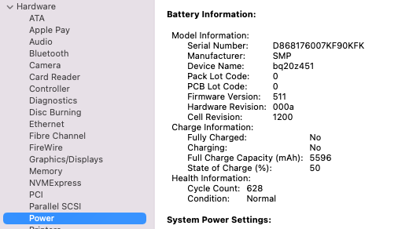

# MacBook Shopping Tracker

---

## Machine Requirements

### Michael's Requirements

**Primary workload:** Claude Code (cloud-based) + light git operations + bash scripting.

| Requirement         | Must-have | Details                                                              |
|---------------------|-----------|----------------------------------------------------------------------|
| **CPU**             | M-series  | M3+ preferred for Homebrew support and modern macOS; M2 acceptable   |
| **RAM**             | 16GB      | 8GB minimum works; 16GB recommended for multi-file Claude sessions   |
| **Storage**         | 256GB+    | Code repos + Claude cache                                            |
| **macOS**           | Tahoe+    | Monterey acceptable but EOL mid-2026; Tahoe/Sonoma preferred         |
| **Battery health**  | >80%      | For used/refurbished; confirm cycle count and original Apple battery |
| **Activation Lock** | Clean     | Must be free of MDM enrollment and Activation Lock                   |
| **Warranty**        | Preferred | 1-year+ coverage valuable for refurbished/used machines              |
| **Homebrew**        | No Intel  | Apple Silicon avoids deprecation warnings (cosmetic but annoying)    |

**Why these matter:** Claude Code is cloud-based (low local load). Git is pure CLI. M-series avoids Homebrew nag. 16GB RAM provides headroom for multi-file analysis.

**AI/Claude Code specific:** Stable WiFi/ethernet, low latency API calls. No GPU needed (cloud inference). Browser memory for large context windows (16GB headroom).

**Not needed:** Native IDEs, compilers, video editing, GPU (integrated is sufficient), high local CPU, native LLM training.

---

### Wendy's Requirements

**Primary workload:** Safari browser with 10-50+ concurrent tabs + SaaS web services (ChatGPT, Sheets, Docs, MailChimp, webmail).

| Requirement         | Must-have | Details                                                              |
|---------------------|-----------|----------------------------------------------------------------------|
| **CPU**             | M3+       | **M3 minimum** (M2 no longer available; M4+ acceptable but overkill) |
| **RAM**             | 16GB      | **CRITICAL.** Safari tab management requires 16GB minimum            |
| **Storage**         | 256GB+    | SaaS data lives in cloud; local storage is minimal need              |
| **macOS**           | Tahoe+    | Monterey acceptable short-term (EOL mid-2026); prefer Tahoe/Sonoma   |
| **Display quality** | 1080p+    | For streaming video (Amazon Prime) and web browsing clarity          |
| **Video codec**     | 1080p+    | Streaming playback support (H.264, VP9)                              |
| **Battery health**  | >80%      | For used/refurbished; confirm cycle count                            |
| **Activation Lock** | Clean     | Must be free of MDM enrollment                                       |
| **Warranty**        | Preferred | 1-year+ coverage; return policy valuable for peace of mind           |

**Why these matter:** RAM is the limiter for 50+ Safari tabs. CPU is irrelevant (cloud-first user). Display quality for video streaming and web comfort. Battery health ensures machine doesn't fail mid-day.

**Zoom calls specific:** Built-in mic/camera sufficient (1080p+ video). Thermal management (quiet fan or fanless). Stable WiFi. Audio codec support (Opus, H.264 video).

**Not needed:** High CPU, discrete GPU (integrated is sufficient), compilers, development tools, large local storage, gaming/3D capabilities.

---

## CPU Comparison: Intel vs M1-M5

| Chip                                         | Year | Details                                                              |
|----------------------------------------------|------|----------------------------------------------------------------------|
| **Intel i5 1.8 GHz dual-core** (wolf-air)    | 2015 | Baseline; Homebrew nags; Monterey capped; aging display (1440×900)   |
| **Intel i5 2.0 GHz quad-core** (michael-pro) | 2020 | Sequoia support; Tahoe-compatible but aging; thermal throttling risk |
| M1                                           | 2020 | 8x leap over Intel; fanless; can run Claude Code; still solid used   |
| M2                                           | 2021 | +15% speed; same core count; good refurb value                       |
| **M3**                                       | 2023 | +25% speed; efficiency bump; **recommended for Michael**             |
| M4                                           | 2024 | +15% speed; overkill for light development; cost jump                |
| M5                                           | 2025 | +20% speed; longest OS support; expensive; not needed                |

**Practical takeaway:**

- M3 is the sweet spot for Michael (git + Claude Code).
- M2 acceptable if found cheap.
- Intel (wolf-air/michael-pro) = risky (aging, thermal issues).
- M4/M5 = wasted performance for your use case.

---

## How to Find Battery Cycle Count (GUI)

When asking sellers for battery health, they can check this way without Terminal:

1. Click **Apple menu** (top-left) → **About This Mac**
2. Click **System Report...** button
3. In the left sidebar, click **Power**

**What to look for:** The Power section shows Health Information with Cycle Count and Condition.  In this example, Cycle Count is "628" and Condition is "Normal"

1. Look for **Cycle Count** in the Health Information section (e.g., "628 cycles")
2. Look for **Condition** (should be "Normal" or "Good"; avoid "Fair" or "Replace Soon")
3. Send you a screenshot, or photo, or simple text with the two values

**Rule of thumb:**

- Under 300 cycles = excellent (new);
- 300-700 = good (refurb baseline);
- 700-1000 = acceptable (used);
- >1000 = worn (avoid unless heavily discounted).

---

## Air vs Pro: Does It Matter?

**Short answer:** Not for Michael or Wendy. Air is perfectly adequate and cheaper.

| Factor          | MacBook Air                               | MacBook Pro (13-16")                  |
|-----------------|-------------------------------------------|---------------------------------------|
| **Target**      | Consumers, light work                     | Professionals, compute-heavy work     |
| **Weight**      | ~2.7-3.1 lbs                              | ~3.4-4.7 lbs (heavier)                |
| **Display**     | 13.3-15.3" (2560×1600+)                   | 14-16" (3072×1920+); ProMotion on Pro |
| **Thermals**    | Passive or single fan (quiet)             | Multiple fans (more cooling capacity) |
| **Speakers**    | Good stereo                               | Six speakers (overkill for SaaS)      |
| **GPU cores**   | M3: 8; M4: 10                             | M3 Pro: 16+; M3 Max: 20               |
| **Price**       | $1,199-$1,499 (M3/M4)                     | $1,999-$3,499+ (Pro/Max)              |
| **For Michael** | ✅ **SUFFICIENT** (Claude Code, git, bash) | ❌ Overkill; wastes $800+              |
| **For Wendy**   | ✅ **SUFFICIENT** (Safari, SaaS)           | ❌ Overkill; unnecessary expense       |

**Historical context:** Wendy had a Pro (wendy-pro M2 8GB), which was overkill and also underpowered (8GB RAM). An Air 16GB would have been better value. Michael should stick with Air.

---

## Display Resolution Evolution

When did 1080p+ become standard for MacBook Air? And what do these resolutions mean?

**Resolution reference:**

- **1080p** = 1920×1080 (1080 vertical pixels = baseline HD standard)
- **1080p+** = anything with >1080 vertical pixels (width doesn't matter for "1080p" naming)
- **2560×1600** = 2560 wide, 1600 tall = qualifies as 1080p+ (520 pixels taller than 1080p baseline)
- **2560×1664** = 2560 wide, 1664 tall = qualifies as 1080p+ (584 pixels taller than 1080p baseline)

| Generation          | Year | Resolution | Vertical pixels | Status                                |
|---------------------|------|------------|-----------------|---------------------------------------|
| MacBook Air 11"/13" | 2015 | 1440×900   | 900             | **Below 1080p;** considered obsolete  |
| MacBook Air 13"     | 2018 | 2560×1600  | 1600            | **1080p+ standard;** first Retina     |
| MacBook Air M1      | 2020 | 2560×1600  | 1600            | Retina maintained; above 1080p        |
| MacBook Air M2      | 2022 | 2560×1600  | 1600            | 1080p+ Retina standard                |
| MacBook Air M3      | 2024 | 2560×1664  | 1664            | 1080p+ Retina; slightly taller aspect |

**Practical:** wolf-air (2015, 1440×900, 900 vertical) has a substandard display. Candidate machines (M2/M3, 1600-1664 vertical) all meet modern 1080p+ expectations. Wendy will notice the display quality jump immediately.

---

## Active Listings

### Quick Comparison (Candidates)

| #       | Offering          | CPU + Model + Screen   |   RAM |   Disk |   Price | OS/EOL          | Video        | Batt   | MDM   | Cond          | Status                |
|---------|-------------------|------------------------|------:|-------:|--------:|-----------------|--------------|--------|-------|---------------|-----------------------|
| 0       | wolf-air          | i5 1.8 dual            |     8 |    128 |         | Monterey/2026   | 1440×900     | 630    | No    | Good          | Interim (Shared)      |
| 0       | michael-pro       | i5 2.0 quad            |    16 |    256 |         | Sequoia/2027    | Retina       | 150%   | No    | Damaged       | Water damage          |
| 0       | wendy-pro         | M2 (8-core)            |     8 |    256 |         | Sequoia/2027    | Retina       | ???    | No    | Abandoned     | Water damage          |
| ------- | --------------    | ---------------------- | ----: | -----: | ------: | --------------- | ------------ | ------ | ----- | ------------- | -------------------   |
| ~~1~~   | ~~#1 (archived)~~ | M2 Air 13              |    16 |    512 |     615 | Sonoma/2028     | 1080p+       | ???    | ???   | eBay Refurb   | Awaiting reply        |
| ~~2~~   | ~~#2 (archived)~~ | M2 Air 13              |     8 |    512 |     550 | Sonoma/2028     | 1080p+       | ???    | ???   | F5 Refurb     | Negotiable; risky     |
| 3       | #3                | M3 Air 13              |    16 |    ??? |     777 | Sonoma/2028     | 1080p+       | ???    | ???   | ???           | Out of stock          |
| 43      | #43               | M3 Air 13              |    16 |    256 |     750 | Sonoma/2028     | 2560×1600    | ???    | ???   | Open Box      | ✅ PURCHASED (Michael) |
| ~~44~~  | ~~#44 (gone)~~    | M3 Air 13              |    16 |    512 |     850 | Sequoia/2027    | 2560×1664    | ???    | ???   | Open Box      | ~~SOLD~~ (Oct 2026)   |
| 49      | #49               | M3 Air 13              |    16 |    512 |     765 | Sonoma/2028     | 2560×1600    | 71     | No    | Used          | Jarts (⚠️ No returns) |

---

### #1 (Archived) --- Wisetek Market M2 Refurb

**Status:** Archived (superseded by #43)

- **Link:** [eBay Listing #800079144456](https://www.ebay.com/itm/800079144456)
- **Price:** $614.50
- **Machine:** Apple MacBook Air (M2, 2022), 13.6", 16GB RAM, Space Gray
- **Condition:** eBay Refurbished
- **Note:** M2 refurb. #43 (M3 Open Box) is better value at $750 (newer chip, brand new condition).

---

### #2 (Archived) --- ITAD Technologies M2, 8GB

**Status:** Archived (insufficient RAM)

- **Link:** [eBay Listing #128000806739](https://www.ebay.com/itm/128000806739)
- **Price:** $549.99
- **Machine:** Apple MacBook Air 13" (M2), 8GB LPDDR5, 512GB SSD
- **Condition:** Refurbished by ITAD Technologies
- **Note:** Only 8GB RAM (below recommended). #43 or #3 are better choices.

---

### #3 --- M3 MacBook Air (Out of Stock)

**Status:** Waiting for restock

- **Link:** [eBay Listing #800050023010](https://www.ebay.com/itm/800050023010?var=&stype=1&widget_ver=artemis&media=SMS)
- **Machine:** Apple MacBook Air (13-inch, M3, 2024), 16GB RAM, Space Gray
- **CPU:** M3 (8-core: 4 performance + 4 efficiency)
- **RAM:** 16GB
- **Storage:** TBD (standard M3 Air is 512GB)
- **Condition:** TBD
- **Price:** TBD
- **Assessment:** M3 16GB is ideal for Michael. Waiting for restock and full details.
- **Fit for Michael:** ✅ **EXCELLENT** --- M3 + 16GB RAM exceeds all requirements; modern chip with long OS support
- **Fit for Wendy:** ✅ **EXCELLENT** --- 16GB RAM meets critical Safari requirement

---

### #43 --- gadgetpickup M3 Open Box 256GB (✅ PURCHASED)

**Status:** PURCHASED 2026-08-10; Order: [24-14983-18990](https://order.ebay.com/ord/show?orderId=24-14983-18990&purchaseOrderId=24-1498-318989#/); Tracking: 1Z1R96V24298428353

- **Link:** [eBay Listing #307108920696](https://www.ebay.com/itm/307108920696) -- Found 2026-08-05, purchased 2026-08-10
- **Seller:** gadgetpickup (99.9% positive, 17.4K ratings)
- **Price:** $749.99
- **Machine:** Apple MacBook Air (13-inch, M3, 2024 model A3113), 16GB RAM, 256GB SSD, Space Gray
- **Condition:** Open Box (brand new, box opened, never used)
- **Returns:** Free 30-day returns
- **Warranty:** None stated (but Open Box condition = effectively new hardware)
- **Seller communication:** Sent message 2026-08-05 @ 15:15 asking seller to include MagSafe 3 power adapter (listing photo showed USB adapter, which is incompatible with M3 Air). Awaiting response.
- **Assessment:** ✅ Best value. M3 16GB, brand new condition, top-tier seller, lowest price in active hunt.
- **Fit for Michael:** ✅ **EXCELLENT** --- M3 + 16GB RAM + brand new condition. Preferred option.
- **Fit for Wendy:** ✅ **EXCELLENT** --- 16GB RAM meets Safari requirement; modern M3 future-proofed through 2030.

---

### #44 --- gadgetpickup M3 Open Box 512GB (~~✅ SOLD~~)

**Status:** SOLD OUT as of 2026-10-07

- **Link:** [eBay Listing #307108922937](https://www.ebay.com/itm/307108922937) -- Listed 2026-08-05, sold by 2026-10-07
- **Seller:** gadgetpickup (99.9% positive, 17.4K ratings) -- same top-tier seller as #43
- **Price:** $849.99
- **Machine:** Apple MacBook Air (13-inch, M3, 2024 model A3113), 16GB RAM, 512GB SSD, Space Gray
- **Condition:** Open Box (brand new, box opened, 100% fully functional)
- **OS:** macOS Sequoia (15.7)
- **Display:** 13 in, 2560 × 1664
- **GPU:** Apple 10-Core (M3)
- **Returns:** Free 30-day returns
- **Warranty:** 1-year Allstate Protection Plan included
- **Assessment:** ✅ Excellent alternative to #43. Same seller, same M3 16GB, but double storage (512GB vs 256GB) for $100 more.
- **Storage tradeoff:** 256GB (#43) is sufficient for Michael (cloud-first user, code repos remote); 512GB (#44) adds peace-of-mind margin for video production.
- **Fit for Michael:** ✅ **EXCELLENT** --- M3 + 16GB RAM + 512GB storage. Premium option if storage peace-of-mind matters.
- **Fit for Wendy:** ✅ **EXCELLENT** --- 16GB RAM + 512GB storage for video production; modern M3 future-proofed through 2030. **RECOMMENDED** (trusted seller, free returns, ample storage for video work).

---

### #49 --- Jarts Auto Parts M3 Used 512GB (⚠️ NO RETURNS RISK)

**Status:** Active listing as of 2026-10-07; used but barely used condition

- **Link:** [eBay Listing #257772522540](https://www.ebay.com/itm/257772522540) -- Found 2026-10-07
- **Seller:** Jarts Auto Parts (186 feedback, 100% positive)
- **Price:** $764.99 (was $899.99, 15% off)
- **Machine:** Apple MacBook Air (13-inch, M3, 2024 model A3113), 16GB RAM, 512GB SSD, Silver
- **Condition:** Used (Barely used; 71 cycle count on battery = practically new)
- **OS:** macOS Sonoma
- **Display:** 13 in, 2560 × 1600
- **GPU:** Apple 10-Core (M3)
- **Battery health:** 71 cycles, "Normal" condition (excellent; <100 cycles is like-new)
- **Returns:** ❌ **SELLER DOES NOT ACCEPT RETURNS** (Risk factor)
- **Warranty:** Optional Allstate 1-year plan available ($74.99 extra)
- **Location:** Riverside, California
- **Shipping:** $16.98 USPS to Michigan
- **Assessment:** ✅ Specs are perfect (M3 16GB 512GB). Price is good ($765 vs $850 for #44). BUT **no return policy is a significant risk**. If machine has hidden issues, Wendy is stuck.
- **Risk mitigation:** Could purchase Allstate 1-year warranty ($74.99) to reach $839.98 total (still cheaper than #44 but adds protection).
- **Fit for Wendy:** ⚠️ **CAUTION** --- Specs excellent, but no-returns policy conflicts with "don't cheap out on Wendy" principle. Consider #44 (same specs, trusted seller, 30-day free returns) instead.

---

## Summary & Next Steps

### Top Contenders: #43 & #44 (gadgetpickup) and #3 (fallback)

#### #43 -- gadgetpickup M3 Open Box 256GB @ $750

- ✅ Available now
- ✅ Brand new (Open Box condition)
- ✅ M3 16GB 256GB (meets requirements)
- ✅ Top seller (99.9%, 17.4K ratings)
- **Action:** PRIMARY TARGET. Monitor daily; stock rotates fast.

#### #44 -- gadgetpickup M3 Open Box 512GB @ $850

- ✅ Available now
- ✅ Brand new (Open Box condition)
- ✅ M3 16GB 512GB (same seller as #43, double storage)
- ✅ Top seller (99.9%, 17.4K ratings)
- **Action:** ALTERNATIVE. $100 more for 2x storage (512GB vs 256GB).

#### #3 -- M3 Air (Out of stock)

- ✅ Ideal specs (M3 16GB)
- ⏳ Waiting for restock
- **Action:** Fallback if #43/#44 sell out.

**For Michael:** #43 ✅ PURCHASED (M3 16GB 256GB, $750).

**For Wendy:** ⏳ **HUNTING M3 16GB 512GB** -- #44 sold out. Options: #49 (risky no-returns) or #43 (fallback, tight storage). **Need new trusted seller with free returns.**

**Next steps (Oct 2026 update):**

1. **Wendy hunting:** Search eBay for M3 16GB 512GB (no M2, no M1) with free returns
2. **Target sellers:** gadgetpickup (if #44 restocks), reviveit.io, itsworthmore, eBay Refurbished dealers
3. **When purchasing:** Verify battery cycle count (<200 for refurb, <50 for Open Box), confirm Activation Lock is clean
4. **Ask seller:** Confirm return policy (30+ days free returns preferred), battery health status, included warranty
5. **Fallback:** If only 256GB available, use #43 (gadgetpickup Open Box); acceptable but tight for video production

---

## Wendy Air Candidates Summary (Updated: Oct 2026)

### Status: #44 SOLD OUT (gadgetpickup M3 512GB)

~~#44 was ideal (Open Box, 30-day returns, 512GB, $850) but sold.~~ **NEED NEW M3 16GB 512GB LISTING.**

---

### Current Requirement: M3 ONLY (No M2)

**Wendy's machine:** M3 MacBook Air, 16GB RAM, **512GB preferred** (256GB fallback), Open Box or Very Good Refurb, **30-day returns required**.

**Price target:** $750-$900.

---

### Available Options

#### #49 -- Jarts Auto Parts M3 Used 512GB ⚠️ (No Returns)

**Link:** [eBay #257772522540](https://www.ebay.com/itm/257772522540) -- Found 2026-10-07

| Factor         | Value                         |
|----------------|-------------------------------|
| Price          | $764.99                       |
| Specs          | M3 16GB 512GB                 |
| Condition      | Used (71 cycles, barely used) |
| Returns        | ❌ **NO** (Risk)               |
| Recommendation | ⚠️ **SKIP**                   |

**Why:** Specs perfect, but no-return policy conflicts with "don't cheap out on Wendy."

---

#### #43 -- gadgetpickup M3 Open Box 256GB (Fallback Only)

**Link:** [eBay #307108920696](https://www.ebay.com/itm/307108920696) -- Purchased 2026-08-10 (Michael's machine, out of stock).

| Factor         | Value                                |
|----------------|--------------------------------------|
| Price          | $749.99                              |
| Specs          | M3 16GB **256GB**                    |
| Condition      | Open Box (new)                       |
| Returns        | ✅ **Free 30-day**                    |
| Recommendation | ⚠️ **Fallback if 512GB unavailable** |

**Why:** Same trusted seller as Michael's. But storage tight for video production.

---

### Hunt New M3 16GB 512GB Listings

**Search:** `M3 MacBook Air 16GB 512GB -M2 -M1`

**Target sellers:** gadgetpickup (proven), reviveit.io (Very Good refurb), itsworthmore (refurb tested)

**Must-have:** Free returns (30+ days), 1-year warranty preferred, battery cycle count <200.

**Add any new M3 512GB finds below with direct eBay links.**
